# Introduction

These are the steps that are required to build the botlab from scratch using MAAS and Juju. These steps will take us from an empty bare metal cluster that is managed by MAAS on through to a production ready instantiation of Kubeflow. Follow along.

## MAAS and Juju

It is assumed that MAAS is already deployed, configured and physical nodes that we will be provisioning for our private cloud are added to MAAS and available for provisioning.

We will also assume that you've followed the instructions to point juju at the MAAS instance by adding a MAAS cloud to juju according to the instructions outlined [here](https://jaas.ai/docs/clouds)

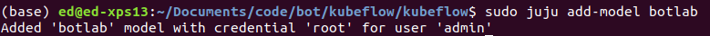

Once the model has been added, we can then check that the model has been added within the Juju GUI, which will have been configured when deploying juju on a server in the MAAS cloud that has been previously defined. This is out of scope of our documentation but is easily found online.

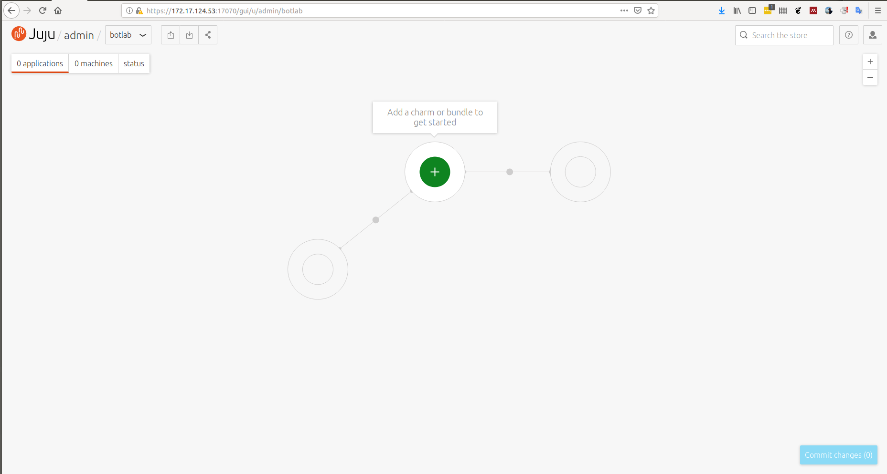

Once our model has been created we can then manually add a few machines from our MAAS instance to the model that has been previously defined.

We can manually add machines via the juju client by issuing the `juju add-machine` command. This will query available nodes within the MAAS instance and add them to the juju model that has been defined.

Once the machines have been added we can check the status of the nodes in multiple ways. The first is by querying the machine status via the juju client by issuing the `juju status` command. This will provide an output like the one shown below.

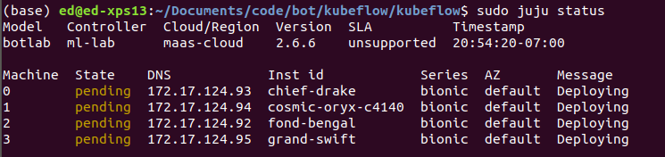

We can see that the nodes that we've added to this model are currently in the process of being provisioned. We can continue checking juju for the status of these nodes, but we can also check the MAAS interface for the status of the nodes, as well. Below is a screenshot as an example.

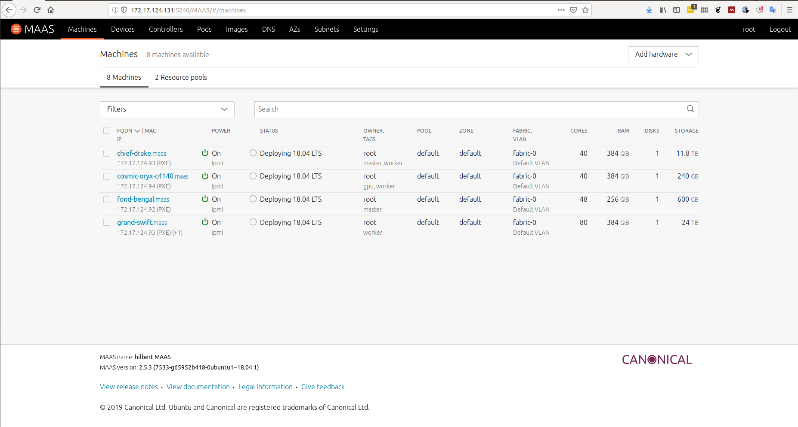

We can see above that the nodes are currently in a deployed status within MAAS, as well, as they have been added to the model `botlab` being deployed by juju.

To monitor the progress of the nodes being provisioned, we can issue the `watch --color juju status --color` command and this will watch the juju status command for changed as the nodes are deployed. An example of this is shown below.

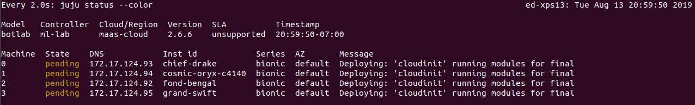

## Juju Charms

Once these nodes have been provisioned for the juju model we can then look into deploying [juju charms](https://jaas.ai/docs/charm-bundles). Charms are a packaging construct that juju can interpret to deploy applications onto nodes that have been provisioned using juju. In this example we are going to deploy a [Kubernetes](https://kubernetes.io/docs/home/) charm onto the nodes that have been added to our juju model. There are many charms available online within the [juju store](https://jaas.ai/). One can deploy these applications at will on the nodes added to the mode.

## Kubernetes, Nvidia, and Juju

In our example we want to utilize GPU's for training models that will be running on our bot platforms so we will want to install a version of Kubernetes that can support scheduling of GPU's along with all of the required software for access NVIDIA GPU's via docker containers, within our cluster. We will outline the steps that are required, here.

### Juju Charm

There are may ways to add charms to an existing model within juju that has been deployed on the MAAS cloud. In this example we will use the juju GUI for a visual representation of what will be provisioned and installed wthin the juju model.

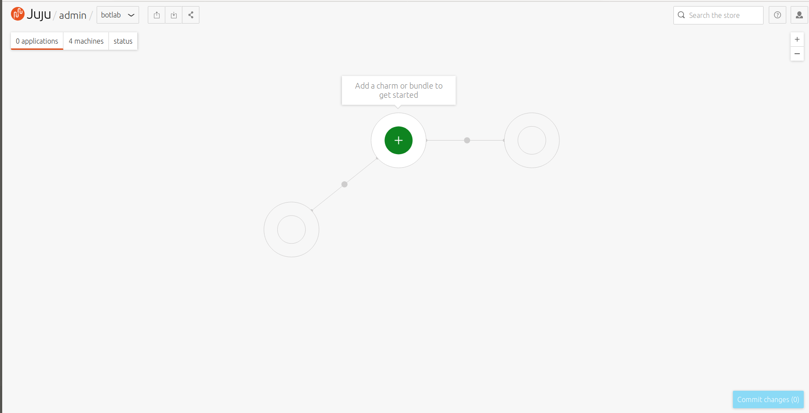

Clicking the green plus sign with the "Add a charm or bundle to get started" call out and that will take us to the charm store, shown below.

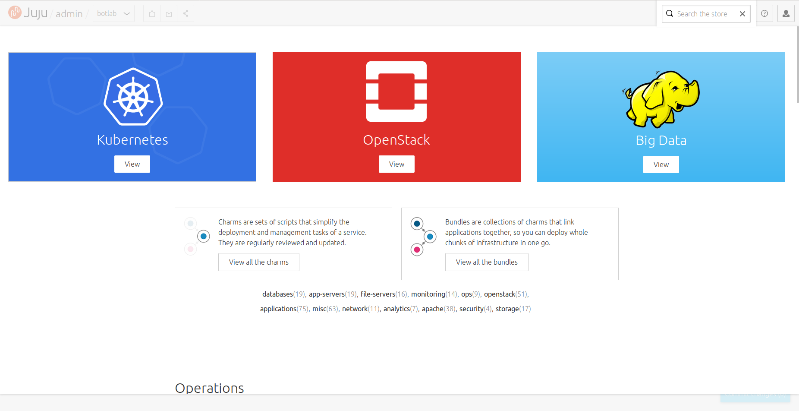

We have many options for charms and bundles that we can deploy within out `juju model` that we've created. It's important to highlight that charms are a single instance of an application packages to run on the juju platform, while bundles are many charms that are bundled together to then run together.

Bundles can be defined as either `.yaml` files, or they can be manually deployed as I'm showing you in this guide. I will also include an export of the result of our efforts for future use, at least in my lab. When defining a bundle there will be many environment specific characteristics that you may want to account for. In my case, due to the limited nature of the node counts and hardware available to me, I will limit certain charms (kubernetes services) to run on specific nodes. I will walk you through how I accomplish this below.

### Kubernetes Bundle

Juju's open source nature allows for any juju user to define charms and bundles and provide them back to the community for other to use. Canonical maintains a few "supported" versions of Kubernetes called `The Canonical Distribution of Kubernetes`. We won't be using this example within the Juju store, however, as version 1.15 of Kubernetes and CDK have broken support for NVIDIA GPU's as NVIDIA requires a special [docker runtime](https://github.com/NVIDIA/nvidia-docker) to access GPU's from within containers. In this case we'll use v1.13 in order to maintain GPU and docker support. In this repo there is a file named `k8s-nvidia.yml` and this contains an environment specific bundle definition for deployment using Juju. These services can all be modified to accomodate for any other machines and services that one may want to deploy. For brevity wrt our environment we can do a `--dry-run` to see how deploying this definition via juju with effect our environment. We can issue the dry run using the command below

```
juju deploy k8s-nvidia.yml --dry-run
```

When we issue this command we will see juju provide a list of the actions that will be performed.

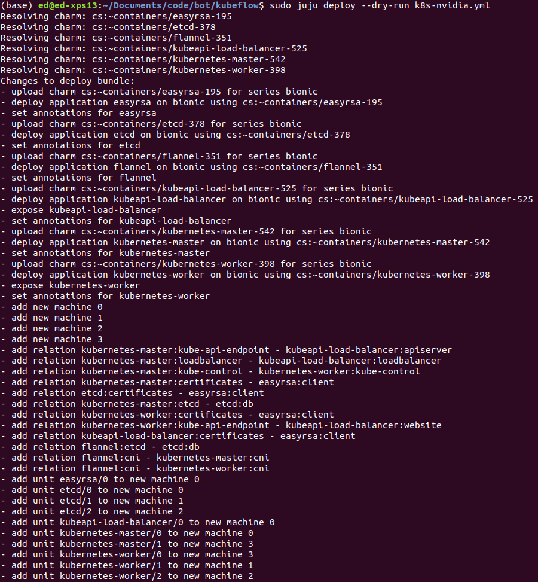

We can see above that there are a few steps that are performed. All of the charms are resolved, and annotations are set with respect to each application/charm. Machines are then added. It is important to note here, as we are using MAAS as our underlying bare metal management system, that MAAS will be providing these machines via juju for this deployment.

If we are happy with the results of the `--dry-run` we can then deploy our bundle. To deploy our bundle we issue the same command, but without the `--dry-run` flag. In this example, I wanted to monitor the log of the deployment, so I've added the `--show-log` flag.

I've not taken a screenshot here, rather just collected log data.

```
(base) ed@ed-xps13:~/Documents/code/bot/kubeflow$ sudo juju deploy k8s-nvidia.yml --show-log
08:00:46 INFO  juju.cmd supercommand.go:57 running juju [2.6.6 gc go1.10.4]
08:00:46 INFO  juju.juju api.go:67 connecting to API addresses: [172.17.124.100:17070]
08:00:46 INFO  juju.api apiclient.go:624 connection established to "wss://172.17.124.100:17070/model/37eccadb-4a90-48cb-827d-d89b2fa8cbc2/api"
08:00:46 INFO  juju.juju api.go:67 connecting to API addresses: [172.17.124.100:17070]
08:00:46 INFO  juju.api apiclient.go:624 connection established to "wss://172.17.124.100:17070/api"
Resolving charm: cs:~containers/easyrsa-195
Resolving charm: cs:~containers/etcd-378
Resolving charm: cs:~containers/flannel-351
Resolving charm: cs:~containers/kubeapi-load-balancer-525
Resolving charm: cs:~containers/kubernetes-master-542
Resolving charm: cs:~containers/kubernetes-worker-398
Executing changes:
- upload charm cs:~containers/easyrsa-195 for series bionic
- deploy application easyrsa on bionic using cs:~containers/easyrsa-195
08:01:12 INFO  juju.cmd.juju.application series_selector.go:140 with the series "bionic" defined by the bundle
  added resource easyrsa
- set annotations for easyrsa
08:01:13 INFO  cmd bundle.go:1062   setting annotations:
08:01:13 INFO  cmd bundle.go:1064     gui-x: "450"
08:01:13 INFO  cmd bundle.go:1064     gui-y: "550"
- upload charm cs:~containers/etcd-378 for series bionic
- deploy application etcd on bionic using cs:~containers/etcd-378
08:01:34 INFO  juju.cmd.juju.application series_selector.go:140 with the series "bionic" defined by the bundle
  added resource etcd
  added resource snapshot
- set annotations for etcd
08:01:35 INFO  cmd bundle.go:1062   setting annotations:
08:01:35 INFO  cmd bundle.go:1064     gui-x: "800"
08:01:35 INFO  cmd bundle.go:1064     gui-y: "550"
- upload charm cs:~containers/flannel-351 for series bionic
- deploy application flannel on bionic using cs:~containers/flannel-351
08:01:55 INFO  juju.cmd.juju.application series_selector.go:140 with the series "bionic" defined by the bundle
  added resource flannel-amd64
  added resource flannel-arm64
  added resource flannel-s390x
- set annotations for flannel
08:01:56 INFO  cmd bundle.go:1062   setting annotations:
08:01:56 INFO  cmd bundle.go:1064     gui-x: "450"
08:01:56 INFO  cmd bundle.go:1064     gui-y: "750"
- upload charm cs:~containers/kubeapi-load-balancer-525 for series bionic
- deploy application kubeapi-load-balancer on bionic using cs:~containers/kubeapi-load-balancer-525
08:02:14 INFO  juju.cmd.juju.application series_selector.go:140 with the series "bionic" defined by the bundle
- expose kubeapi-load-balancer
- set annotations for kubeapi-load-balancer
08:02:14 INFO  cmd bundle.go:1062   setting annotations:
08:02:14 INFO  cmd bundle.go:1064     gui-x: "450"
08:02:14 INFO  cmd bundle.go:1064     gui-y: "250"
- upload charm cs:~containers/kubernetes-master-542 for series bionic
- deploy application kubernetes-master on bionic using cs:~containers/kubernetes-master-542
08:02:52 INFO  juju.cmd.juju.application series_selector.go:140 with the series "bionic" defined by the bundle
  added resource cdk-addons
  added resource kube-apiserver
  added resource kube-controller-manager
  added resource kube-proxy
  added resource kube-scheduler
  added resource kubectl
- set annotations for kubernetes-master
08:02:52 INFO  cmd bundle.go:1062   setting annotations:
08:02:52 INFO  cmd bundle.go:1064     gui-x: "800"
08:02:52 INFO  cmd bundle.go:1064     gui-y: "850"
- upload charm cs:~containers/kubernetes-worker-398 for series bionic
- deploy application kubernetes-worker on bionic using cs:~containers/kubernetes-worker-398
08:03:51 INFO  juju.cmd.juju.application series_selector.go:140 with the series "bionic" defined by the bundle
  added resource cni-amd64
  added resource cni-arm64
  added resource cni-s390x
  added resource kube-proxy
  added resource kubectl
  added resource kubelet
- expose kubernetes-worker
- set annotations for kubernetes-worker
08:03:52 INFO  cmd bundle.go:1062   setting annotations:
08:03:52 INFO  cmd bundle.go:1064     gui-x: "100"
08:03:52 INFO  cmd bundle.go:1064     gui-y: "850"
- add new machine 0
- add new machine 1
- add new machine 2
- add new machine 3
- add relation kubernetes-master:kube-api-endpoint - kubeapi-load-balancer:apiserver
- add relation kubernetes-master:loadbalancer - kubeapi-load-balancer:loadbalancer
- add relation kubernetes-master:kube-control - kubernetes-worker:kube-control
- add relation kubernetes-master:certificates - easyrsa:client
- add relation etcd:certificates - easyrsa:client
- add relation kubernetes-master:etcd - etcd:db
- add relation kubernetes-worker:certificates - easyrsa:client
- add relation kubernetes-worker:kube-api-endpoint - kubeapi-load-balancer:website
- add relation kubeapi-load-balancer:certificates - easyrsa:client
- add relation flannel:etcd - etcd:db
- add relation flannel:cni - kubernetes-master:cni
- add relation flannel:cni - kubernetes-worker:cni
- add unit easyrsa/0 to new machine 0
- add unit etcd/0 to new machine 0
- add unit etcd/1 to new machine 1
- add unit etcd/2 to new machine 2
- add unit kubeapi-load-balancer/0 to new machine 0
- add unit kubernetes-master/0 to new machine 0
- add unit kubernetes-master/1 to new machine 3
- add unit kubernetes-worker/0 to new machine 3
- add unit kubernetes-worker/1 to new machine 1
- add unit kubernetes-worker/2 to new machine 2
Deploy of bundle completed.
08:04:00 INFO  cmd supercommand.go:502 command finished
```

We can see above that the deploy command finished successfully. We can now monitor the status of this deployment using the `juju status` command. If we want to monitor the status in real time we can watch the command, as well.

```
watch --color juju status --color
```

the `--color` flag will allow the native colored logging output of the juju client. A screenshot is shown below.

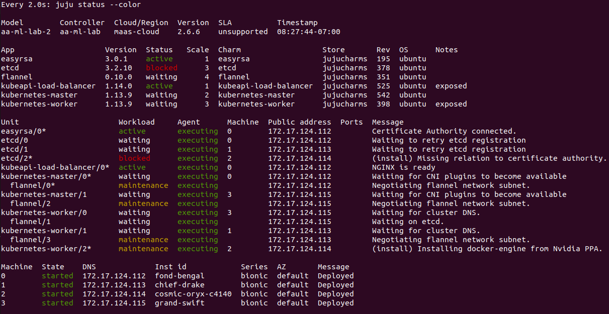

Now we wait until the deployment has finished. We can continue watching the status screen until everything has turned green and has a status of `active`. 

```
NOTE: It could take some time for the deployment to finish. Please do not be impatient.
```
We can also monitor the status of each individual juju agent using the `debug-log` command :

```
juju debug-log
```
This will provide aggregated output from each individual agent running on all of the nodes. An example screenshot can be seen below.

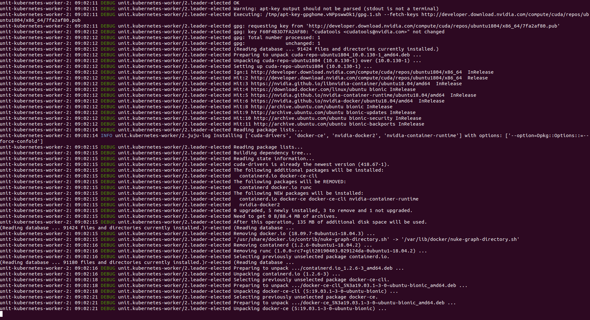

### NVIDIA-DOCKER2

An important note when configuring this cluster is that there is a step missing in the node configuration for accessing nodes with NVIDIA GPU's. This is an area where this automation process could be improved but I am fixing it manually, for the time being. This is a good `TODO` to add to the list for the future.

We can see in the screenshot below that machine 2, which happens to be our machine with GPU's is sitting in the `waiting for kubelet to start` phase. This is because the docker daemon cannot start on the node without us modifying a few specific properties about the node.

Specifically, we need to register the `nvidia` runtime with systemd on the node with GPU's.

We can do this by following the below steps

```
sudo mkdir -p /etc/systemd/system/docker.service.d
sudo tee /etc/systemd/system/docker.service.d/override.conf <<EOF
[Service]
ExecStart=
ExecStart=/usr/bin/dockerd --host=fd:// --add-runtime=nvidia=/usr/bin/nvidia-container-runtime
EOF
sudo systemctl daemon-reload
sudo systemctl restart docker
```

When can then verify that docker was able to start using systemd 

```
sudo systemctl status docker
```

If the above commands were successful we should now see that the service is running, as shown below.

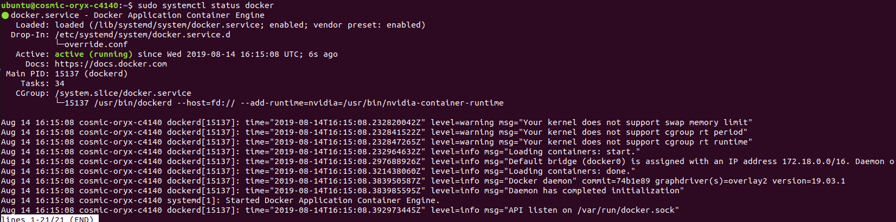

This should allow the node to finish being provisioned within juju. 

```
Note this will take a few minutes as changes propagate within the system.
```

If we've remained patient enough during this whole process we should now have a functional Kubernetes cluster! We can see in the screenshot below that all systems are active!

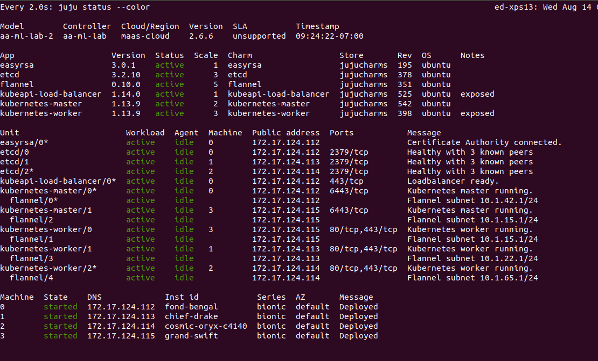

Once this process is complete, we can now download the `kubeconfig` file and append our [kubectl](https://kubernetes.io/docs/tasks/tools/install-kubectl/) file using juju, as well. This will give our kubectl utility access to this freshly deployed Kubernetes cluster.

This single command should download the config file for you

```
sudo juju scp kubernetes-master/0:config ~/.kube/config
```

If this completes without any errors, we can quickly check the status of the current Kubernetes pods running on the cluster using the following command 

```
kubectl get pods --all-namespaces
```

A screenshot of the output of this command is below.

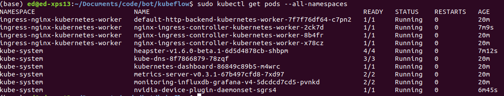

## Kubeflow

[Kubeflow](https://www.kubeflow.org/docs/about/kubeflow/) is a framework that allows for quick(er) and easier definitions of Machine Learning pipelines. We will be leveraging this framework in much of our machine learning efforts so it only makes sense for us to get a version of this up and functional for use within our cluster.

Kubeflow is designed to be agnostic to whatever platform one would like to deploy it on. With the one requirement that the platform it is to be deployed on is Kubernetes. What this means is that we can deploy Kubeflow on many of the major cloud provider platforms, but also on bare metal, as we will be doing in this tutorial.

There are a few constraints that we will also be taking into account with our deployment, specifically that we won't be leveraging any of the large open source storage solutions such as Ceph or HDFS (yet). We will stick strictly to NFS for the time being. We will migrate this solution at a later date.

### Kubeflow and NFS

Before we get started deploying Kubeflow, we will need to prep our environment to accomodate the NFS deployment we will want to use. We can do this by following the steps below.

We will assume that users of this guide have an understanding of [Persistent Volumes](https://kubernetes.io/docs/concepts/storage/persistent-volumes/), [Persistent Volume Claims](https://kubernetes.io/docs/concepts/storage/persistent-volumes/#persistentvolumeclaims), and [Dynamic Provisioning](https://kubernetes.io/docs/concepts/storage/dynamic-provisioning/). If you ***_do not_*** have an understanding of these, or need a refresher, please refer to the link as Kubeflow has hard dependencies on storage required for databases that support the underlying Kubeflow services.

#### NFS

[NFS](https://en.wikipedia.org/wiki/Network_File_System) is a well understood and battle tested network based file system abstraction that allows us to read and write data over an IP based network. We will leverage this for storage for both the Kubeflow system along with any Kubeflow user file system requirements. In this section of the guide, we will only cover what is required for Kubeflow.

##### NFS Server

We will first start by configuring which server, in our cluster, that we would like to be the [NFS Server](https://help.ubuntu.com/lts/serverguide/network-file-system.html). Once we have identified this node, we can then install the required NFS packages and start the required services. We will also need to create a directory on the node's local file system and share that out.

Use the following command to install the required NFS packages

```
sudo apt-get install nfs-common
sudo apt-get install nfs-kernel-server
```

Once these dependencies are installed, we can the create a directory somewhere on the host file system that we will share out using NFS.

```
sudo mkdir /nfsroot
```

The above command will make a file at the root of the host file system called `nfsroot`. Below we will modify the `/etc/exports` file to allow all nodes read/write access to this directory, via NFS.

```
/nfsroot *(rw,no_root_squash,no_subtree_check)
```

```
NOTE: I am assuming NO security requirements here. Please modify this exports file accordingly.
```

Once these dependencies are installed, the directory is created, and the `/etc/exports` file has been modified, we can then proceed with deploying an NFS provisioner for Kubernetes.

##### NFS Client

We will also need to install the NFS client packages on all nodes within the cluster. The good news is Ubuntu 18.04 Bionic has these packages pre-installed. If your nodes do not have them, please run the following command on the nodes.

```
sudo apt-get install nfs-common
```

#### NFS Dynamic Provisioner

We will now need to deploy an [NFS Provisioner](https://github.com/helm/charts/tree/master/stable/nfs-client-provisioner) on the cluster. This will enable Dynamic Provisioning of Persistent Volumes and Persistent Volume Claims for anything that is deployed within the Kubernetes cluster.

Deploying the NFS Provisioner uses a tool called [helm]() which can be installed using the instructions found [here](https://helm.sh/docs/using_helm/#install-helm).

Once helm is installed, we can then issue the following command to deploy and NFS Provisioner

```
helm install 
  --name nfs-client-provisioner \
  --set nfs.server=<NFS Server IP> \
  --set nfs.path=/exported/path \
  --set storageClass.name=nfs \
  --set storageClass.defaultClass=true \
  stable/nfs-client-provisioner
```

where `<NFS Server IP>` is the IP address of the NFS server you've configured above and `/exported/path` is the directory you've defined within the `/etc/exports` file, above.

Once the helm deployment has completed, we can check the status of the NFS provisioner by issueing the following command

```
kubectl get pods
```

This will check the default namespace for running pods and output them. We can see below that our NFS provisioner pod is listed.

!(NFS Provisioner)(images/verify-nfs-provisioner.png)

We can also verify that our default storage class has changed, as well, by issuing the `kubectl get sc` command. The output should look something like this.

```
NAME            PROVISIONER                            AGE
nfs (default)   cluster.local/nfs-client-provisioner   6m49s
```

We can now proceed to deploying Kubeflow.

#### MetalLB

In order an on prem Kubeflow cluster to function there is a requirement for a loadbalancer that can assign addressing to the outside services for Kubeflow. Currently the "built-in" istio based load balancer doesn't support this, so we will have to use another load balancer called [MetalLB](https://metallb.universe.tf/installation/)

This installation is _very_ straight forward and can be done with a single command and using a pre-defined Kubernetes manifest.

```
kubectl apply -f https://raw.githubusercontent.com/google/metallb/v0.8.1/manifests/metallb.yaml
```

Once we issue this command we can validate the deployment by checking the status of the pods in the newly created `metallb-system` namespace. An example of the deployment, it's output, and checking the status of the respective pods can be seen below 

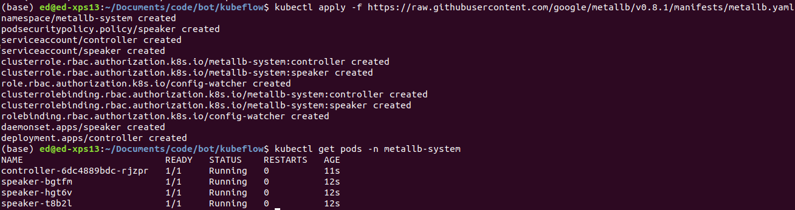

Once we have deployed the pods, we will then need to provide a configuration that defined the IP address range(s) available for provisioning by our MetalLB instance.

An example of this configuration is below

```
apiVersion: v1
kind: ConfigMap
metadata:
  namespace: metallb-system
  name: config
data:
  config: |
    address-pools:
    - name: default
      protocol: layer2
      addresses:
      - <insert L3 addressing>/<subnetmask in CIDR notation>
```

Depending on the deployment constraints of your environment you might be required to define further configuration, but in this example we will only be providing L3 addressing for L2 segments within the Kubernetes cluster.

We can then apply this configuration with the following command, this will create a ConfigMap within Kubernetes for MetalLB to use.

```
kubectl apply -f <config_file>.yaml
```

One can then verify this configuration using the `kubectl get configmap -n metallb-system` command.

### Kubeflow

Now that we have our bare metal servers provisioned, kubernetes deployed, our NFS share configured, and a load balancer deployed and configured, we can move on to [installing Kubeflow on an existing cluster](https://www.kubeflow.org/docs/started/k8s/kfctl-existing-arrikto/).

This process is straight forward and shouldn't provide many issues as long as everything above has been completed successfully.
